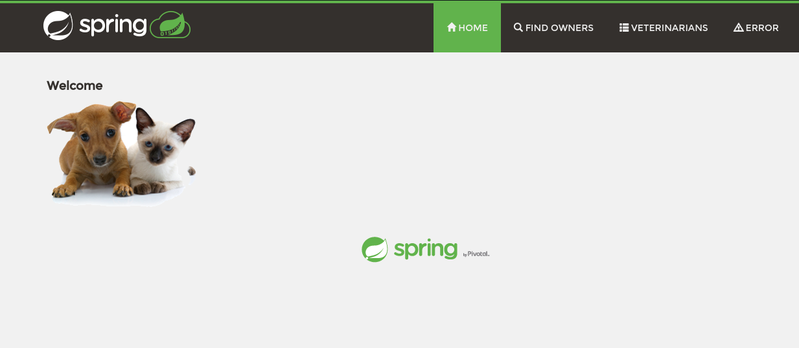
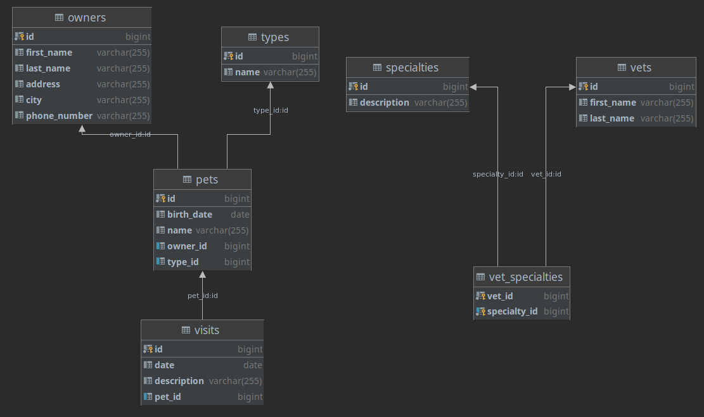

[](https://app.circleci.com/pipelines/github/Mohammad-Dwairi)

# Spring Pet Clinic 
___
## Description

Spring Pet Clinic is a community-driven project to demonstrate different aspects and best practices of Spring framework.

This project is a cloned version of the original [spring-petclinic](https://github.com/spring-projects/spring-petclinic) project with some changes.

Pet Clinic is a website where you can register pets and manage their owners information, clinic visits, vets and specialties.

It is a multi-module project where all web-related files are in the `pet-clinic-web` module, and all data-related files are
in the `pet-clinic-data` module.

This repository is connected with [CircleCi](https://circleci.com) for continuous integration.


___
## Used in this project

- JDK 11
- Maven 
- Spring Boot
- Spring Data JPA
- Thymeleaf template engine
- In-Memory H2 database in the development profile
- Mysql database in the production profile
- Project Lombok
- JQuery and Bootstrap Webjars
- WRO4J (Web Resource Optimizer for Java)
- Junit 5 and Mockito for Testing
___
## Requirements

- JDK 11
- Maven

___
## Building and Running
1. Clone the repository
   ```bash
   git clone https://github.com/Mohammad-Dwairi/Spring-Pet-Clinic.git
   ```
2. Navigate to the cloned folder
   ```bash
   cd Spring-Pet-Clinic
   ```
3. Install the required dependencies, this will also compile and package the project
   ```bash
   mvn clean install
   ```
4. Run the application
    ```bash
    java -jar pet-clinic-web/target/pet-clinic-web-0.0.1-SNAPSHOT.jar
    ```
   OR
    ```bash
    cd pet-clinic-web && mvn spring-boot:run
    ```
5. Go to the browser and visit 
   ```
   localhost:8080
   ```
   ### OR use Docker!
___
## Docker
### This application is uploaded publicly to Docker Hub, Just pull the image and run it.
*You must have Docker installed to be able to run the image*
1. Pull the image from Docker Hub
    ```bash
    docker pull mdwairi/spring-pet-clinic:latest
    ```
2. Run the image
    ```bash
    docker run -p 8080:8080 mdwairi/spring-pet-clinic:latest
    ```
___
## ER Diagram 

___
## Spring Profiles
- You can change the active profile in the `application.properties` file.
- The `dev` profile is used in the development environment, this will configure spring-boot according to `application-dev.properties`.
- The `prod` profile is used in the production environment, this will configure spring-boot according to `application-prod.properties`.
- The `map` profile is used to inject custom Map implementation instead of JPA, used only for demonstration purposes.
- The `springjpa` profile is used to inject Spring Data JPA implementation.
- You must have a mysql schema named `petclinic` before you can run the application on `prod` profile.
- Change `spring.jpa.hibernate.ddl-auto=validate` to `spring.jpa.hibernate.ddl-auto=update` in the `application-prod.properties` 
  file the first time you run `prod` profile to allow Spring JPA to create database tables based on the entity classes.

___
## Credits
- [spring-petclinic](https://github.com/spring-projects/spring-petclinic)
- [Spring Framework 5: Beginner to Guru](https://www.udemy.com/course/spring-framework-5-beginner-to-guru/)


